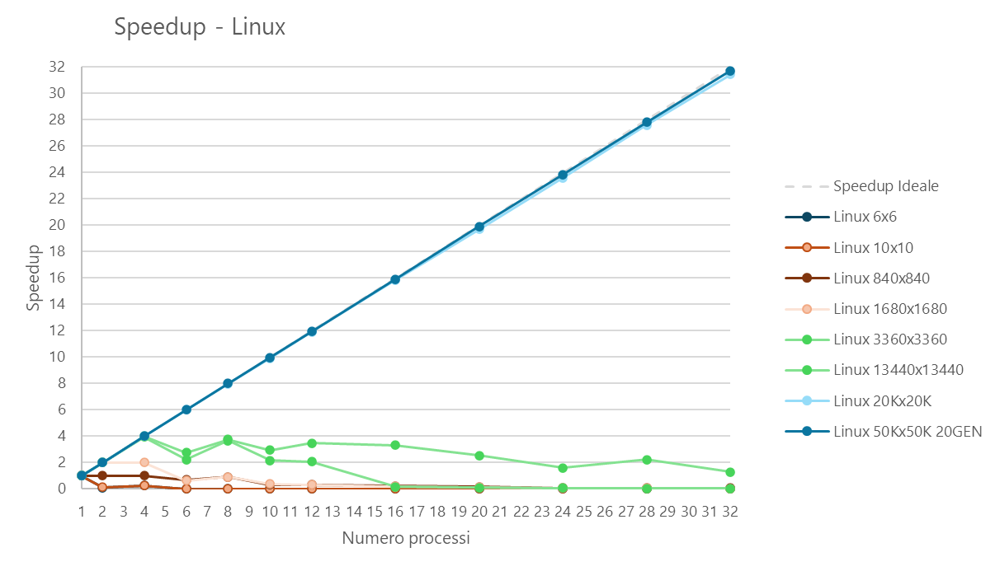
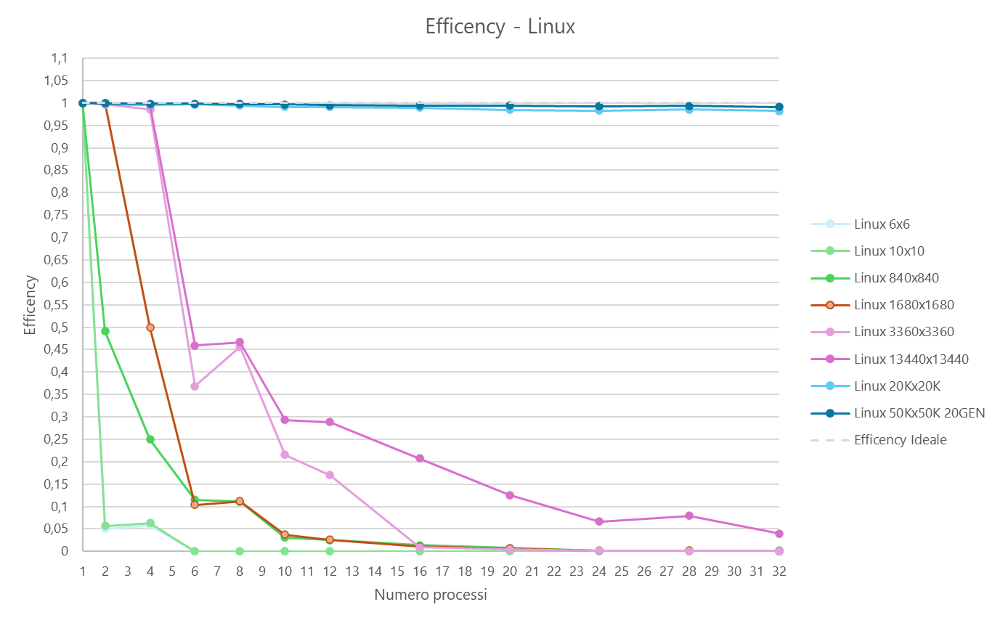
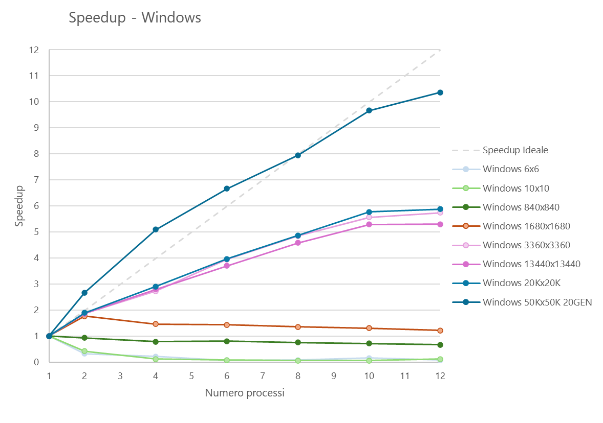
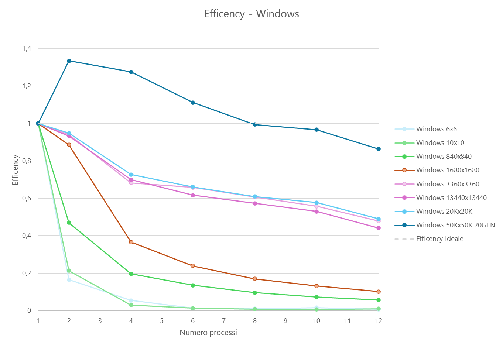
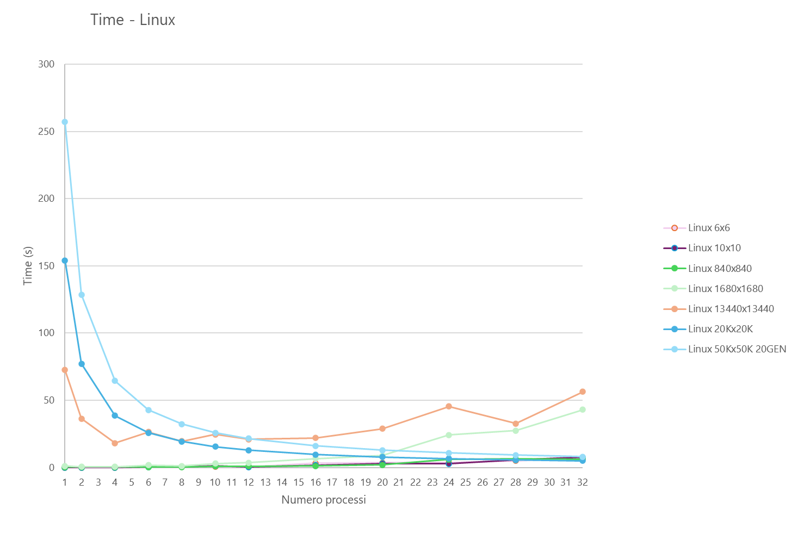
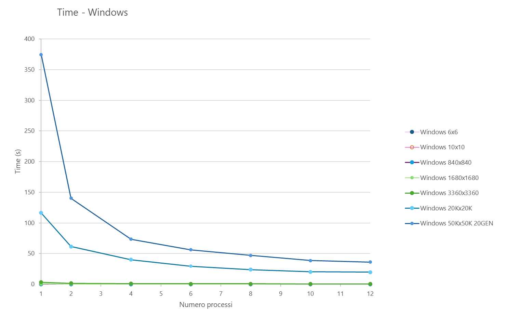
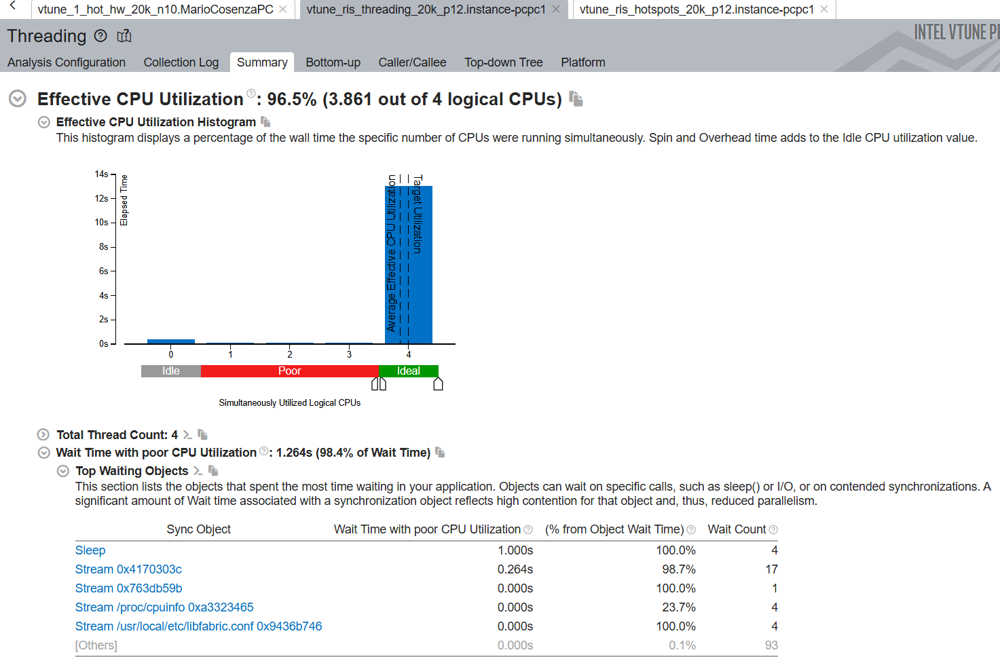
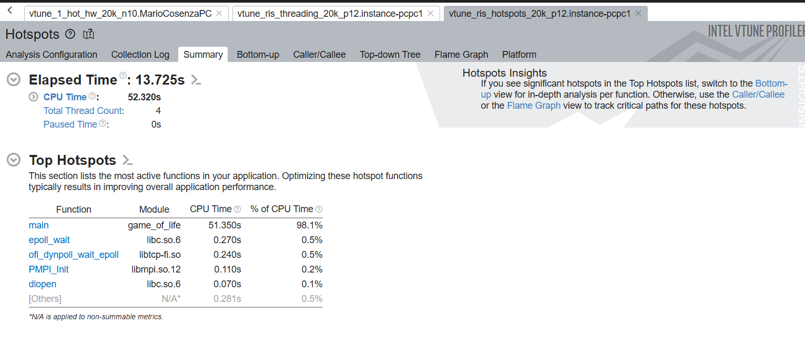
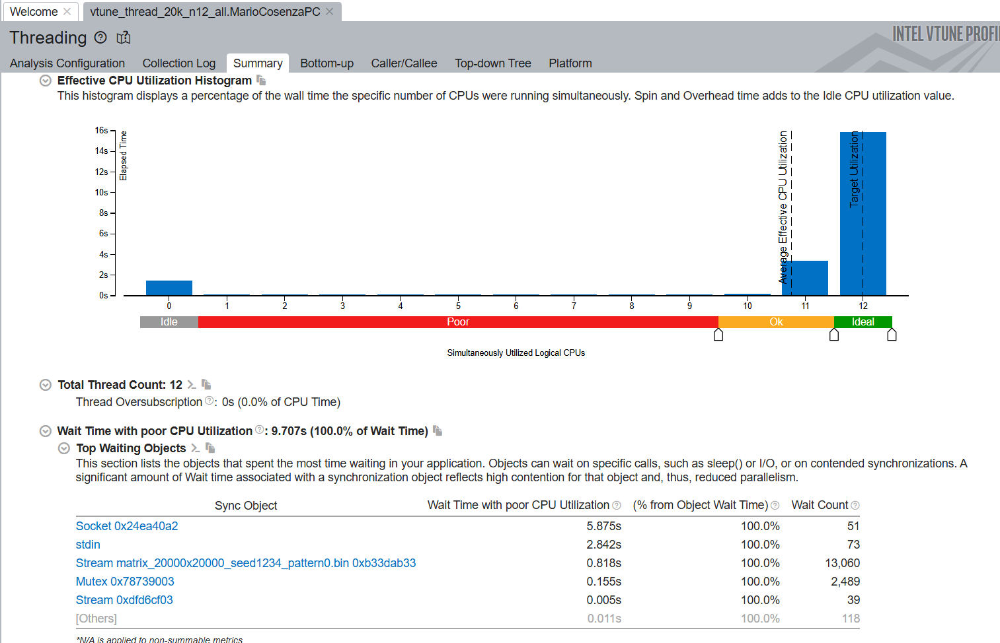

# Game of Life di Conway in MPI

<p align="center">
    
</p>

[](https://github.com/mariocosenza)
[](LICENSE)
[](README.md) [](README-it.md)

Questo repository raccoglie gli esercizi di laboratorio e il progetto finale del corso di **Programmazione Concorrente, Parallela e su Cloud** (A.A. 2026) presso l'Universita di Salerno, sotto la supervisione del Prof. [@spagnuolocarmine](https://github.com/spagnuolocarmine).

Per garantire la riproducibilita degli esperimenti, il progetto sfrutta Infrastructure as Code (IaC). Nel repository e presente uno script di configurazione Terraform (`main.tf`) pensato per provisionare automaticamente un cluster di calcolo su Google Cloud Platform (GCP). Per istruzioni complete di deployment, fai riferimento alla sezione *Come configurare l'esperimento*.

La directory `mpi` contiene il codice sorgente dei Lab 3 fino al Lab 8, insieme a una cartella dedicata agli esempi. Il cuore di questo repository e il **Lab 8**, il progetto finale del corso, che valuta paradigmi avanzati di calcolo parallelo usando lo standard C Message Passing Interface (MPI). Tra i tre possibili filoni progettuali, questo repository implementa una versione distribuita di **Conway's Game of Life**.

Tutte le sezioni successive di questa documentazione si concentrano esclusivamente sull'architettura, sull'implementazione e sull'analisi delle prestazioni di questo progetto finale.

## Indice

Clicca su un badge per andare alla sezione corrispondente.

[](#il-gioco-della-vita-di-conway) [](#requisiti-della-soluzione) [](#correttezza)

[](#setup-sperimentale-e-metodologia-di-benchmark) [](#configurazione-hardware-per-il-benchmark) [](#esecuzione-del-test)

[](#convenzione-di-naming-delle-matrici) [](#risultato-finale)

## Il Gioco della Vita di Conway

Conway's Game of Life e un **automa cellulare** iconico ideato dal matematico britannico John Horton Conway nel 1970. E classificato come un *gioco a zero giocatori*, cioe la sua evoluzione dipende interamente dallo stato iniziale e non richiede ulteriori interventi umani.

Il gioco si svolge su una griglia bidimensionale ortogonale, infinita o limitata, composta da celle quadrate, ciascuna delle quali puo trovarsi in uno di due stati possibili: **viva** o **morta**. Ogni cella interagisce con gli otto vicini immediati (**vicinato di Moore**). Ad ogni passo temporale (generazione), il sistema passa allo stato successivo sulla base di un insieme deterministico di regole applicate simultaneamente a tutte le celle:

* **Sottopopolazione:** qualsiasi cella viva con meno di due vicini vivi muore.
* **Sopravvivenza:** qualsiasi cella viva con due o tre vicini vivi sopravvive invariata alla generazione successiva.
* **Sovrappopolazione:** qualsiasi cella viva con piu di tre vicini vivi muore.
* **Riproduzione:** qualsiasi cella morta con esattamente tre vicini vivi diventa viva.

Dal punto di vista computazionale, la sincronizzazione deterministica della griglia e le dipendenze locali del vicinato rendono il Game of Life un candidato ideale per la **decomposizione di dominio** e per valutazioni di scalabilita parallela con MPI.

## Requisiti della soluzione

### Architettura e paradigma di base
Il sistema distribuito e implementato interamente in **C** nativo e sfrutta la libreria standard **Message Passing Interface (MPI)** per la parallelizzazione in ambienti a memoria distribuita.

### Flessibilita della griglia
Il software supporta dinamicamente configurazioni matriciali arbitrarie ($M \times N$). Gestisce topologie non uniformi, distribuzioni irregolari dei bordi e rapporti d'aspetto variabili senza alcun vincolo dimensionale hardcoded.

### Profondita di esecuzione
L'applicazione esegue la simulazione dell'automa cellulare per un numero di generazioni definito dall'utente ($G \ge 0$). Impostare una profondita pari a zero preserva la configurazione iniziale senza eseguire aggiornamenti del ciclo di vita.

### Decomposizione centralizzata del dominio
La fase di inizializzazione e completamente centralizzata. Il nodo master (Rank 0) acquisisce la matrice globale completa non segmentata, gestisce la partizione iniziale del dominio e controlla il flusso di esecuzione distribuendo i frammenti iniziali ai processi worker al momento dell'esecuzione.

### Invarianza rispetto ai processi
La meccanica parallela interna, gli scambi di halo e i calcoli di frontiera sono rigorosamente deterministici. Lo stato finale della simulazione e completamente indipendente dalla topologia del cluster di esecuzione, producendo risultati identici bit per bit indipendentemente dal numero di processi.

### Allocazione dinamica delle risorse
Il codice si adatta dinamicamente all'ambiente di esecuzione a runtime. Il sistema scala i propri confini orizzontali in modo da corrispondere esattamente al numero di processi indicato dall'utente al lancio (ad esempio `mpirun -np <P>`).

### Topologia cartesiana dei processi
I processi worker sono disposti su una griglia cartesiana MPI bidimensionale. Il codice sceglie prima il massimo numero di processi che soddisfa ancora i vincoli minimi sulla dimensione locale della matrice, poi ricava la forma della griglia con `MPI_Dims_create(compute_sz, 2, mpi_dims)`. Questo produce una disposizione righe/colonne che riflette i rank disponibili invece di una mesh hardcoded.

Ogni worker crea poi un comunicatore cartesiano con `MPI_Cart_create(split_comm, 2, mpi_dims, (int[]){0, 0}, 0, &cart_comm)`. I flag di periodicita pari a zero significano che la topologia non e avvolta ai bordi, quindi i rank ai margini della griglia hanno vicini mancanti. Tali relazioni di vicinato vengono recuperate con `MPI_Cart_shift` e sono usate direttamente per gli scambi di halo sui bordi superiore, inferiore, sinistro e destro.

Questa disposizione mantiene il pattern di comunicazione esplicito e facile da ragionare: ogni rank scambia celle fantasma solo con i rank adiacenti nella griglia di processo 2D, e lo stesso comunicatore cartesiano viene riutilizzato anche per l'I/O collettivo del file della matrice finale.

### Persistenza dello stato finale
Al termine dell'ultima iterazione, le partizioni distribuite della matrice vengono raccolte automaticamente e ricomposte sul nodo master per ricostruire la generazione finale completa, che viene poi salvata su storage persistente.

Tutti gli snippet di implementazione riportati sotto sono tratti da [mpi/lab8/lab8vm-file.c](mpi/lab8/lab8vm-file.c). Sono raggruppati in blocchi `<details>` nascosti che rimangono chiusi di default, cosi la spiegazione resta compatta finche non espandi ogni sezione.

<details>
<summary><u>Sezione dettagli</u>: il primo helper suddivide una dimensione globale tra i rank MPI disponibili e memorizza sia le dimensioni per rank sia gli offset di partenza.</summary>

```c
void partition_dimension(uint32_t total, int parts, int *sizes, int *offsets) {
    uint32_t q = total / (uint32_t)parts;
    uint32_t r = total % (uint32_t)parts;
    uint32_t small = (uint32_t)parts - r;
    uint32_t curr_offset = 0;

    for (int i = 0; i < parts; i++) {
        sizes[i] = (int)((uint32_t)i < small ? q : q + 1);
        if (offsets != NULL) {
            offsets[i] = (int)curr_offset;
        }
        curr_offset += (uint32_t)sizes[i];
    }
}
```

</details>

<details>
<summary><u>Sezione dettagli</u>: l'helper successivo legge la sottomatrice locale assegnata a un worker dal file binario globale usando gli offset calcolati dal processo master.</summary>

```c
void read_matrix_from_file(void *out_matrix, int *sizes, int *subsizes, int *starts) {
#ifdef _WIN32
    FILE *fp = _fsopen(filename, "rb", _SH_DENYNO);
#else
    FILE *fp = fopen(filename, "rb");
#endif
    if (!fp) {
        MPI_Abort(MPI_COMM_WORLD, EXIT_FAILURE);
    }

    int starts_r_offset = starts[0];
    int starts_c_offset = starts[1];
    int size_c = sizes[1];
    int M = subsizes[0];
    int N = subsizes[1];

    uint8_t (*matrix)[N] = (uint8_t (*)[N])out_matrix;

    for (int i = 0; i < M; i++) {
        long long offset = ((long long)(starts_r_offset + i) * size_c + starts_c_offset) * sizeof(uint8_t);
#ifdef _WIN32
        _fseeki64(fp, (__int64)offset, SEEK_SET);
#else
        fseeko(fp, (off_t)offset, SEEK_SET);
#endif
        fread(matrix[i], sizeof(uint8_t), N, fp);
    }

    fclose(fp);
}
```

</details>

<details>
<summary><u>Sezione dettagli</u>: questo blocco avvia le receive non bloccanti per le ghost row superiore e inferiore usate durante lo scambio di halo.</summary>

```c
void async_recv_top_bottom(MPI_Comm comm, Game_matrix *gm, int top_rank, int bot_rank, MPI_Request req[2]) {
    req[0] = MPI_REQUEST_NULL;
    req[1] = MPI_REQUEST_NULL;
    if (top_rank != MPI_PROC_NULL) {
        MPI_Irecv(gm->recv_t_ghost, (int)gm->size.cols, MPI_UINT8_T, top_rank, 1, comm, &req[0]);
    }
    if (bot_rank != MPI_PROC_NULL) {
        MPI_Irecv(gm->recv_b_ghost, (int)gm->size.cols, MPI_UINT8_T, bot_rank, 1, comm, &req[1]);
    }
}
```

</details>

<details>
<summary><u>Sezione dettagli</u>: la routine worker gestisce la porzione locale della matrice, scambia i layer fantasma con i vicini, evolve l'automa per ogni generazione e, se richiesto, scrive su disco lo stato distribuito finale.</summary>

```c
void run_worker(int mpi_dims[2], MPI_Comm split_comm, int sizes[2], int subsizes[2], int starts[2]) {
    int w_rank;
    MPI_Comm_rank(split_comm, &w_rank);

    MPI_Comm cart_comm;
    MPI_Cart_create(split_comm, 2, mpi_dims, (int[]){0, 0}, 0, &cart_comm);

    uint32_t local_rows = (uint32_t)subsizes[0];
    uint32_t local_cols = (uint32_t)subsizes[1];

    if (local_rows == 0 || local_cols == 0) {
        MPI_Abort(MPI_COMM_WORLD, EXIT_FAILURE);
    }

    uint8_t (*local_grid)[local_cols] = malloc(sizeof(uint8_t[local_rows][local_cols]));
    if (!local_grid) {
        MPI_Abort(MPI_COMM_WORLD, EXIT_FAILURE);
    }

    read_matrix_from_file(local_grid, sizes, subsizes, starts);

    uint8_t *recv_l_ghost = calloc(local_rows + 2, sizeof(uint8_t));
    uint8_t *recv_r_ghost = calloc(local_rows + 2, sizeof(uint8_t));
    uint8_t *recv_t_ghost = calloc(local_cols, sizeof(uint8_t));
    uint8_t *recv_b_ghost = calloc(local_cols, sizeof(uint8_t));
    uint8_t *send_l_buf   = malloc((local_rows + 2) * sizeof(uint8_t));
    uint8_t *send_r_buf   = malloc((local_rows + 2) * sizeof(uint8_t));
    
    uint8_t (*next_local_grid)[local_cols] = malloc(sizeof(uint8_t[local_rows][local_cols]));

    if (!recv_l_ghost || !recv_r_ghost || !recv_t_ghost || !recv_b_ghost || !send_l_buf || !send_r_buf || !next_local_grid) {
        MPI_Abort(MPI_COMM_WORLD, EXIT_FAILURE);
    }

    Game_matrix gm = {
        .size         = { local_rows, local_cols },
        .matrix       = local_grid,
        .recv_l_ghost = recv_l_ghost,
        .recv_r_ghost = recv_r_ghost,
        .recv_t_ghost = recv_t_ghost,
        .recv_b_ghost = recv_b_ghost,
    };

    int top_rank, bot_rank, left_rank, right_rank;
    MPI_Cart_shift(cart_comm, 0, 1, &top_rank, &bot_rank);
    MPI_Cart_shift(cart_comm, 1, 1, &left_rank, &right_rank);

    MPI_Request req_recv_tb[2], req_send_tb[2];
    MPI_Request req_recv_lr[2], req_send_lr[2];
    MPI_Status  mpi_stats[2];

    for (int g = 0; g < N_GEN; g++) {
        async_recv_top_bottom(cart_comm, &gm, top_rank, bot_rank, req_recv_tb);
        async_send_top_bottom(cart_comm, &gm, top_rank, bot_rank, req_send_tb);

        for (uint_fast32_t r = 1; r + 1 < local_rows; r++) {
            for (uint_fast32_t c = 1; c + 1 < local_cols; c++) {
                play_inner_cells(gm.matrix, next_local_grid, r, c, local_cols);
            }
        }

        MPI_Waitall(2, req_recv_tb, mpi_stats);
        MPI_Waitall(2, req_send_tb, mpi_stats);

        pack_left_right_send_buffers(&gm, send_l_buf, send_r_buf);
        
        async_recv_left_right(cart_comm, &gm, left_rank, right_rank, req_recv_lr);
        async_send_left_right(cart_comm, &gm, left_rank, right_rank, send_l_buf, send_r_buf, req_send_lr);

        MPI_Waitall(2, req_recv_lr, mpi_stats);
        MPI_Waitall(2, req_send_lr, mpi_stats);

        for (uint_fast32_t c = 0; c < local_cols; c++) {
            play_border_cells(&gm, next_local_grid, 0, c);
            if (local_rows > 1) {
                play_border_cells(&gm, next_local_grid, local_rows - 1, c);
            }
        }
        
        for (uint_fast32_t r = 1; r + 1 < local_rows; r++) {
            play_border_cells(&gm, next_local_grid, r, 0);
            if (local_cols > 1) {
                play_border_cells(&gm, next_local_grid, r, local_cols - 1);
            }
        }

        void *tmp_ptr   = gm.matrix;
        gm.matrix       = next_local_grid;
        next_local_grid = tmp_ptr;
    }

    
    if (SAVE_OUTPUT) {
        MPI_Datatype file_type;
        MPI_Type_create_subarray(2, sizes, subsizes, starts,
                             MPI_ORDER_C, MPI_UINT8_T, &file_type);
        MPI_Type_commit(&file_type);
        MPI_File fh;
        MPI_File_open(cart_comm, "full_matrix.bin", 
                      MPI_MODE_CREATE | MPI_MODE_WRONLY, MPI_INFO_NULL, &fh);
                      MPI_File_set_view(fh, 0, MPI_UINT8_T, file_type, "native", MPI_INFO_NULL);

        MPI_File_write_all(fh, gm.matrix, local_rows * local_cols, MPI_UINT8_T, MPI_STATUS_IGNORE);
    
        MPI_File_close(&fh);
        MPI_Type_free(&file_type);
    }

    free(recv_l_ghost);
    free(recv_r_ghost);
    free(recv_t_ghost); 
    free(recv_b_ghost);
    free(send_l_buf);
    free(send_r_buf);
    free(next_local_grid);
    free(gm.matrix);
    
    MPI_Comm_free(&cart_comm);
}
```

</details>

<details>
<summary><u>Sezione dettagli</u>: la routine master calcola la partizione 2D, prepara i metadati per ogni worker e invia le informazioni di dimensione e offset necessarie per ricostruire il layout globale.</summary>

```c
void run_master(int mpi_dims[2], MPI_Comm split_comm, uint32_t M, uint32_t N, int sizes[2], int subsizes[2], int starts[2]) {
    int row_sizes[mpi_dims[0]], row_offsets[mpi_dims[0]];
    int col_sizes[mpi_dims[1]], col_offsets[mpi_dims[1]];
    
    partition_dimension(M, mpi_dims[0], row_sizes, row_offsets);
    partition_dimension(N, mpi_dims[1], col_sizes, col_offsets);

    sizes[0] = (int)M; 
    sizes[1] = (int)N;

    int compute_sz;
    MPI_Comm_size(split_comm, &compute_sz);

    for (int i = 1; i < compute_sz; i++) {
        int r_idx = i / mpi_dims[1];
        int c_idx = i % mpi_dims[1];
        
        int sub[2] = { row_sizes[r_idx], col_sizes[c_idx] };
        int st[2]  = { row_offsets[r_idx], col_offsets[c_idx] };

        MPI_Send(sizes, 2, MPI_INT, i, 0, split_comm);
        MPI_Send(sub, 2, MPI_INT, i, 1, split_comm);
        MPI_Send(st, 2, MPI_INT, i, 2, split_comm);
    }

    subsizes[0] = row_sizes[0];
    subsizes[1] = col_sizes[0];
    starts[0]   = row_offsets[0];
    starts[1]   = col_offsets[0];
}
```

</details>

<details>
<summary><u>Sezione dettagli</u>: il punto di ingresso <code>main</code> collega l'intera applicazione: legge i parametri utente, inizializza MPI, sceglie quanti processi possono essere usati davvero per la dimensione corrente della matrice, costruisce la griglia di processi 2D, divide il comunicatore globale, assegna i ruoli master e worker e infine riduce il tempo di esecuzione cosi il rank root puo stampare il risultato complessivo del benchmark.</summary>

```c
int main(int argc, char **argv) {
    uint32_t M = 10000;
    uint32_t N = 10000;
    
    parse_args(argc, argv, &M, &N);

    MPI_Init(&argc, &argv);
    MPI_Barrier(MPI_COMM_WORLD);
    double start_time = MPI_Wtime();

    int rank, num_procs;
    MPI_Comm_rank(MPI_COMM_WORLD, &rank);
    MPI_Comm_size(MPI_COMM_WORLD, &num_procs);

    int compute_sz = num_procs;
    while (compute_sz > 1 && !is_min_size((uint32_t)compute_sz, M, N)) {
        compute_sz--;
    }

    int mpi_dims[2] = {0, 0};
    MPI_Dims_create(compute_sz, 2, mpi_dims);

    if (mpi_dims[0] <= 0 || mpi_dims[1] <= 0) {
        MPI_Abort(MPI_COMM_WORLD, EXIT_FAILURE);
    }

    int split_color = (rank < compute_sz) ? 1 : MPI_UNDEFINED;
    MPI_Comm split_comm;
    MPI_Comm_split(MPI_COMM_WORLD, split_color, rank, &split_comm);

    if (split_comm != MPI_COMM_NULL) {
        int sizes[2], subsizes[2], starts[2];

        if (rank == 0) {
            run_master(mpi_dims, split_comm, M, N, sizes, subsizes, starts);
        } else {
            MPI_Recv(sizes, 2, MPI_INT, 0, 0, split_comm, MPI_STATUS_IGNORE);
            MPI_Recv(subsizes, 2, MPI_INT, 0, 1, split_comm, MPI_STATUS_IGNORE);
            MPI_Recv(starts, 2, MPI_INT, 0, 2, split_comm, MPI_STATUS_IGNORE);
        }

        run_worker(mpi_dims, split_comm, sizes, subsizes, starts);
        MPI_Comm_free(&split_comm);
    }

    TimeRankPair local_time = { MPI_Wtime() - start_time, rank };
    TimeRankPair max_time;
    
    MPI_Reduce(&local_time, &max_time, 1, MPI_DOUBLE_INT, MPI_MAXLOC, 0, MPI_COMM_WORLD);

    if (rank == 0) {
        printf("Max Time: %f s (Rank: %d)\n", max_time.time, max_time.rank);
    }

    MPI_Finalize();
    return 0;
}
```

</details>

<details>
<summary><u>Sezione dettagli</u>: l'ultimo utility genera la matrice seme usata come input per la simulazione. Supporta i seguenti parametri: <code>-M &lt;righe&gt;</code>, <code>-N &lt;colonne&gt;</code>, <code>-S &lt;seme&gt;</code> per la generazione casuale deterministica, <code>-P &lt;pattern&gt;</code> per forme predefinite (<code>0</code> random, <code>1</code> glider, <code>2</code> blinker, <code>3</code> block, <code>4</code> input custom/manuale), e <code>-R</code> per leggere <code>full_matrix.bin</code> e stamparlo invece di creare un nuovo file. In modalita custom, il programma chiede il valore di ogni cella e scrive direttamente su disco la matrice 0/1 inserita.</summary>

```c
void write_matrix_to_file_fast(uint32_t M, uint32_t N) {
    char filename[256];
    sprintf(filename, "matrix_%ux%u_seed%u_pattern%d.bin", M, N, SEED, PATTERN);
    FILE *fp = fopen(filename, "wb");
    if (!fp) {
        perror("Errore nell'apertura del file");
        exit(EXIT_FAILURE);
    }

    uint8_t *row_buffer = calloc(N, sizeof(uint8_t));
    if (!row_buffer) {
        printf("Errore di allocazione memoria\n");
        exit(EXIT_FAILURE);
    }

    if (PATTERN == 0) srand(SEED);

    for (uint32_t r = 0; r < M; r++) {
        if (PATTERN != 0) {
            memset(row_buffer, 0, N * sizeof(uint8_t));
        }

        if (PATTERN == 0) {
            for (uint32_t c = 0; c < N; c++) {
                row_buffer[c] = (rand() % 2 == 0);
            }
        } else if (PATTERN == 1 && r < 3 && M >= 3 && N >= 3) {
            // Glider in alto a sinistra
            if (r == 0) { row_buffer[1] = 1; }
            else if (r == 1) { row_buffer[2] = 1; }
            else if (r == 2) { row_buffer[0] = 1; row_buffer[1] = 1; row_buffer[2] = 1; }
        } else if (PATTERN == 2 && M >= 3 && N >= 3) {
            // Blinker al centro
            if (r == M / 2) { row_buffer[N / 2 - 1] = 1; row_buffer[N / 2] = 1; row_buffer[N / 2 + 1] = 1; }
        } else if (PATTERN == 3 && M >= 2 && N >= 2) {
            // Block al centro
            if (r == M / 2 || r == M / 2 + 1) { row_buffer[N / 2] = 1; row_buffer[N / 2 + 1] = 1; }
        }

        fwrite(row_buffer, sizeof(uint8_t), N, fp);
    }

    free(row_buffer);
    fclose(fp);
    
    const char* pattern_names[] = {"Random", "Glider", "Blinker", "Block"};
    printf("Matrice %u x %u scritta su %s (Pattern: %s)\n", M, N, filename, pattern_names[PATTERN]);
}
```

</details>

`verify.c` e un utility di verifica: legge `full_matrix.bin`, stampa la matrice riga per riga e conta le celle vive cosi puoi validare rapidamente lo stato generato.

`view.c` e lo strumento di ispezione visiva: carica le matrici binarie iniziale e finale, le confronta e offre una GUI per passare tra animazioni wipe e fade mostrando statistiche di riepilogo.

## Convenzione di naming delle matrici

Le matrici di input generate per la simulazione seguono il pattern `matrix_<rows>x<cols>_seed<seed>_pattern<pattern>.bin`. Questa convenzione rende ogni file autoesplicativo: le dimensioni della matrice sono inserite per prime, seguite dal seme casuale usato per la generazione deterministica e dal selettore del pattern usato per costruire lo stato iniziale.

L'output principale a runtime prodotto dall'applicazione MPI e `full_matrix.bin`, che memorizza l'intera generazione finale al termine dell'esecuzione distribuita. Insieme, questi nomi rendono semplice tracciare una run dall'input al risultato finale.

## Correttezza

Il generatore, il runtime MPI e gli strumenti visuali usano tutti lo stesso formato grezzo della matrice: un file e semplicemente $M \times N$ byte scritti riga per riga, con un `uint8_t` per cella e senza header. Per questo una matrice creata da [generate_seed.c](mpi/lab8/generate_seed.c) puo essere consumata direttamente da [lab8vm-file.c](mpi/lab8/lab8vm-file.c) e dagli strumenti visuali.

## Report di correttezza e validazione del codice

La correttezza di questa implementazione MPI parallela 2D di Conway's Game of Life e stata validata tramite test su pattern deterministici, controlli visivi incrociati, verifiche focalizzate sui bordi e confronto dei risultati binari.

1. Validazione delle regole locali con pattern statici. Le funzioni di transizione [play_inner_cells](mpi/lab8/lab8vm-file.c) e [play_border_cells](mpi/lab8/lab8vm-file.c) sono state verificate con strutture classiche del Game of Life. Il Block, che e uno still life, e rimasto invariato su piu generazioni, confermando il comportamento corretto di sopravvivenza. Il Blinker, oscillatore, ha alternato tra stato verticale e orizzontale ed e tornato alla configurazione iniziale nelle generazioni pari, confermando le regole attese di transizione delle celle vive.

2. Validazione della decomposizione del dominio e dello scambio delle ghost cell. Il comportamento dei bordi e stato esercitato con pattern posizionati tra i confini dei processi. Un blocco diviso tra due rank adiacenti e rimasto stabile, confermando la correttezza degli scambi halo superiore/inferiore e sinistro/destro. Un glider che attraversa l'intersezione di quattro sottodomini MPI ha mantenuto forma e movimento, coerentemente con la sequenza ordinata di scambio usata dalla routine worker.

3. Confronto manuale con un simulatore visivo. Alcune configurazioni generate sono state confrontate con gli stessi setup iniziali su [PlayGameOfLife.com](https://playgameoflife.com/). L'evoluzione osservata corrispondeva al comportamento atteso passo per passo per i casi testati.

4. Selezione dei pattern e ambito dei test. Il repository si concentra su pattern strutturali rappresentativi invece di enumerare in modo esaustivo ogni oggetto noto del Life. In pratica, testare still life, oscillatori e pattern mobili copre le interazioni locali fondamentali esercitate dall'implementazione.

5. Confronto differenziale dell'output. A seme casuale fissato, i file finali prodotti con diversi numeri di processi MPI sono stati confrontati con SHA-256 su Windows. Gli hash corrispondenti mostrano che, per gli input testati, l'esecuzione parallela ha prodotto stati finali bitwise identici tra quei diversi conteggi di processi.

`pattern 4` in [generate_seed.c](mpi/lab8/generate_seed.c) e la modalita di input manuale. Legge esattamente un valore `0` o `1` per ogni cella, valida l'input e scrive la griglia risultante in ordine row-major su `matrix_<rows>x<cols>_seed<seed>_pattern4.bin`. Poiche il layout di output coincide con il layout a runtime, il file puo essere caricato senza alcun passaggio di conversione.

[view.c](mpi/lab8/view.c) legge lo stesso layout grezzo di byte con un semplice `fread`, quindi puo visualizzare le matrici generate da [generate_seed.c](mpi/lab8/generate_seed.c) finche l'utente seleziona le dimensioni corrette per il file aperto. In altre parole, il viewer non si aspetta un header o un blocco di metadati; si aspetta esattamente lo stesso encoding piatto della matrice usato dal codice MPI.

Esempio di pattern generato 5x5:

<p align="center">
    
</p>

## Setup sperimentale e metodologia di benchmark

La valutazione delle prestazioni di questo sistema distribuito e stata eseguita su due ambienti hardware distinti: una macchina Windows locale per sviluppo e un cluster di calcolo distribuito ad alte prestazioni provisionato su Google Cloud Platform (GCP).

### Setup dell'ambiente Windows locale

Per eseguire un profiling prestazionale comparativo in locale, l'applicazione supporta sia **Microsoft MPI (MS-MPI)** sia **Intel oneAPI MPI**.

#### 1. Implementazione con Microsoft MPI (MS-MPI)

1. Scarica ed esegui il programma di installazione ufficiale di MS-MPI dal [Microsoft Download Center](https://www.microsoft.com/en-us/download/details.aspx?id=105289).
2. Aggiungi manualmente il percorso dei binari alle variabili d'ambiente di sistema (`PATH`) per esporre `mpiexec` e `mpicc` in modo nativo dentro PowerShell o il Prompt dei comandi.
3. Per la compilazione su ambienti Windows `x86-64` tramite GCC (come la toolchain Cygwin), le directory di include e i percorsi delle librerie devono essere linkati esplicitamente.

Puoi automatizzare questo processo di build in Visual Studio Code associando la compilazione a una scorciatoia (`Ctrl+Shift+B`) usando la seguente configurazione dentro `.vscode/tasks.json`:

```json
{
    "label": "Windows: Compile MPI C",
    "type": "shell",
    "command": "gcc",
    "args": [
        "${file}",
        "-o", "${fileDirname}\\${fileBasenameNoExtension}.exe",
        "-I", "C:\\Program Files (x86)\\Microsoft SDKs\\MPI\\Include",
        "-L", "C:\\Program Files (x86)\\Microsoft SDKs\\MPI\\Lib\\x64",
        "-lmsmpi"
    ],
    "group": "build"
}
```

#### 2. Intel oneAPI MPI e profiling con VTune

Per un auditing piu profondo a livello hardware, la scelta principale per questo progetto e stata l'ecosistema Intel MPI, grazie alla disponibilita nativa cross-platform e all'integrazione con la toolchain diagnostica.

Installa Visual Studio 2026 oppure Visual Studio Build Tools 2026, assicurandoti che il workload Desktop Development with C++ sia selezionato e includa in particolare la toolchain MSVC v143 e il Windows 11 SDK.

Scarica l'installer online del Intel oneAPI Base Toolkit e dell'HPC Toolkit.

Seleziona l'opzione Intel VTune Profiler durante il setup. VTune fornisce metriche di performance approfondite per applicazioni distribuite, evidenziando hotspot architetturali, efficienza del threading, caratterizzazioni HPC e colli di bottiglia nell'accesso alla memoria.

> Nota: per attivare il profiling hardware a basso overhead all'interno di VTune, i driver di sampling Intel richiesti devono essere installati con privilegi amministrativi sulla piattaforma.

### Flag di ottimizzazione del compilatore

Anche se Intel fornisce diversi compilatori MPI, tutti i file sorgente di questo progetto vengono compilati con `mpiicx`. Si tratta del piu recente compilatore C/C++ di Intel basato sul framework LLVM moderno, con pass di vectorization e ottimizzazione piu forti.

La stringa di compilazione e stata costruita appositamente per massimizzare l'utilizzo dell'hardware sulla macchina host evitando in sicurezza i colli di bottiglia del compilatore:

```bash
mpiicx -O3 -QxHost -Qipo -ffast-math -Qiopenmp-simd -Qopt-mem-layout-trans:3 /D_CRT_SECURE_NO_WARNINGS lab8vm-file.c -o game_of_life.exe
```

| Flag | Funzione |
| --- | --- |
| `-O3` | Abilita ottimizzazioni aggressive di alto livello, tra cui vectorization dei cicli, unrolling e ristrutturazione aggressiva del codice. |
| `-QxHost` / `-xHost` | Indica al compilatore di generare codice specializzato per le estensioni dell'ISA piu elevate disponibili nativamente sulla macchina di compilazione. |
| `-Qipo` / `-ipo` | Attiva l'ottimizzazione interprocedurale, analizzando le strutture del codice tra piu unita di traduzione per ottimizzare l'inlining delle funzioni. |
| `-ffast-math` | Allenta la conformita stretta allo standard IEEE 754 per la matematica floating-point per accelerare l'esecuzione tramite approssimazioni hardware. |
| `-Qiopenmp-simd` | Forza il compilatore a esaminare e ottimizzare le direttive OpenMP SIMD per vectorizzare i cicli senza overhead di threading a runtime. |
| `-Qopt-mem-layout-trans:3` | Esegue trasformazioni di layout della memoria di livello 3 sulle strutture dati per massimizzare la locality spaziale della cache e migliorare l'allineamento del layout strutturale. |

### Pinning dei processi e affinity dei thread

Per mitigare il jitter di esecuzione causato dal sistema operativo quando migra i processi tra core fisici diversi, e stato imposto il pinning esplicito dei processi tramite le variabili d'ambiente del runtime Intel MPI:

```bash
mpiexec -n <P> -genv I_MPI_PIN_DOMAIN=core -genv I_MPI_PIN_ORDER=compact game_of_life.exe
```

`I_MPI_PIN_DOMAIN=core` vincola ogni processo MPI a un core fisico isolato.

`I_MPI_PIN_ORDER=compact` assegna prima i rank adiacenti ai core vicini, ottimizzando la condivisione della cache e riducendo la latenza inter-node.

### Setup dell'ambiente cluster Linux

Per la valutazione della scalabilita orizzontale, l'orchestrazione del cluster su Google Cloud Platform e completamente automatizzata tramite Terraform, sfruttando uno script di bootstrap dell'infrastruttura (`install.sh`).

Lo script di provisioning automatizza l'intera pipeline di provisioning sui nodi Rocky Linux:

1. Identita utente e privilegi: crea un utente di sistema dedicato `pcpc` associato al gruppo di sicurezza `wheel` per autorizzare l'esecuzione senza password di `sudo`.
2. Provisioning delle dipendenze core: risolve automaticamente i pacchetti tramite `dnf` per installare gli asset di compilazione di sistema (`vim`, `git`, `gcc`, `gcc-c++`, `make`) insieme ai binari di sicurezza (`openssh-clients`, `openssh-server`).
3. Mappatura del repository Intel oneAPI: configura le firme ufficiali dei pacchetti Intel (`oneAPI.repo`) per gestire la verifica dei metadati del repository.
4. Integrazione cloud-native con MPI: rileva automaticamente le istanze GCP e si aggancia a `google_install_intelmpi` per collegare fabric specializzati a bassa latenza.
5. Installazione dello stack HPC: installa lo stack runtime parallelo unificato (`intel-oneapi-compiler-dpcpp-cpp`, `intel-oneapi-mpi-devel` e `intel-oneapi-vtune`).
6. Autenticazione inter-node senza password: inserisce programmaticamente le chiavi RSA di deployment generate (`id_rsa`, `id_rsa.pub`) nel vault `authorized_keys` di tutti i nodi, imponendo confini di sicurezza rigorosi e garantendo un'esecuzione fluida dei rank durante `mpirun`.
7. Setup del repository: clona automaticamente il repository sorgente in `/home/pcpc/pcpc-mpi`.
8. Inizializzazione delle variabili d'ambiente: inietta automaticamente le variabili di compilazione Intel (`setvars.sh`) e le topologie di pinning core direttamente nei profili della shell di login dell'utente (`.bashrc`).
9. Compilazioni native mirate: accede alla directory del workspace e applica dinamicamente i flag di ottimizzazione hardware specifici per Intel Sapphire Rapids (`-xSAPPHIRERAPIDS`) per costruire i binari usando il compilatore `mpiicx` basato su LLVM:

```bash
FLAGS="-O3 -xSAPPHIRERAPIDS -ipo -ffast-math -fiopenmp-simd -qopt-mem-layout-trans=3"
mpiicx $FLAGS generate_seed.c -o generate_seed
mpiicx $FLAGS lab8vm-file.c -o game_of_life
```

## Configurazione hardware per il benchmark

### Macchina Windows locale

| Voce | Dettagli |
| --- | --- |
| Sistema operativo | Windows 11 build 26200 |
| CPU | 12th Gen Intel Core i5-1235U con clock base a 1.30 GHz e fino a 4.40 GHz in turbo, con 2 performance core, 8 efficiency core e 12 processori logici totali |
| Memoria | 8 GB RAM |
| Archiviazione | SSD da 500 GB |
| Profilo energetico | Prestazioni elevate |
| Stato di alimentazione | Collegata all'alimentazione |
| Memoria virtuale | File di swap abilitato |

### Cluster GCP

| Voce | Dettagli |
| --- | --- |
| Regione | `us-west2` |
| Numero di nodi | 8 |
| Politica di posizionamento | `availability_domain_count = 1`, `collocation = "COLLOCATED"` |
| Immagine OS | `rocky-linux-10-optimized-gcp-v20260427` |
| Tipo macchina | `c3-standard-8` |
| CPU | Intel(R) Xeon(R) Platinum 8481C CPU @ 2.70GHz |
| Hyperthreading | Disabilitato |
| Mappatura core | mapping 1:1 tra vCPU e core fisico |
| Memoria | 32 GB RAM per nodo |
| Archiviazione | 40 GB Hyperdisk Balanced, 3000 IOPS, 360 MB/s di throughput |
| Livello rete | Premium |
| Firewall | SSH, TCP e UDP intra-cluster consentiti con il tag `mpi-node` |

<details>
<summary><u>Sezione dettagli</u>: benchmark 7-Zip</summary>

Il grafico seguente confronta il test 7-Zip eseguito con un singolo core e con piu core, offrendo una vista rapida della scalabilita del throughput della CPU locale.


</details>

<details>
<summary><u>Sezione dettagli</u>: benchmark PingPong di Intel MPI</summary>

L'immagine seguente mostra il test PingPong di Intel MPI, che misura la latenza di rete di base tra i nodi del cluster.


</details>

## Esecuzione del test

Per eseguire il benchmark, compila prima il generatore di matrici da [generate_seed.c](mpi/lab8/generate_seed.c) e poi usalo per creare la matrice di input per la simulazione.

| Piattaforma | Passi |
| --- | --- |
| Windows | Compila prima il generatore, poi esegui lo script batch di generazione della matrice. Dopo, avvia [run_game_of_life_test.bat](mpi/lab8/run_game_of_life_test.bat). |
| Linux | Esegui lo script batch di generazione della matrice su ogni nodo in modo che possa creare la matrice di input e l'hostfile compatibile con Intel MPI nel formato `IP:N_CPU`. Poi avvia [run_game_of_life_test.sh](mpi/lab8/run_game_of_life_test.sh). |

Il benchmark scrive il tempo di esecuzione in un file `.txt` insieme alla dimensione della matrice e al numero di processi MPI usati nella run. I risultati del profiling VTune vengono salvati in directory separate che seguono la convenzione di naming della matrice.

> Nota: il test completo puo richiedere circa 30 minuti.

Note aggiuntive:

- Su Linux, assicurati che gli script abbiano i permessi di esecuzione prima di avviarli.
- Su Windows, esegui il test VTune come amministratore.

## Risultato finale

I grafici seguenti sono derivati da [time.csv](mpi/lab8/results/time.csv) e riassumono il comportamento finale del benchmark dell'implementazione. Le sei figure principali sono mostrate come immagini grandi a tutta larghezza, cosi il trend di scalabilita e piu facile da leggere, mentre gli altri grafici dei risultati restano in [mpi/lab8/results/images](mpi/lab8/results/images).

<p align="center">
    
</p>

<p><strong>Speedup - Linux.</strong> Le run su Linux scalano quasi linearmente solo per gli input piu grandi; le matrici piu piccole sono dominate dal costo di comunicazione e di avvio.</p>

<p align="center">
    
</p>

<p><strong>Efficienza - Linux.</strong> L'efficienza resta vicina a 1 per il caso piu grande e degrada rapidamente per le matrici piccole, confermando che il problema deve essere abbastanza grande da ammortizzare il costo parallelo.</p>

<p align="center">
    
</p>

<p><strong>Speedup - Windows.</strong> Windows mostra una crescita piu regolare ma piu limitata, con i migliori guadagni concentrati nelle dimensioni di matrice medie e grandi.</p>

<p align="center">
    
</p>

<p><strong>Efficienza - Windows.</strong> La curva di efficienza scende con l'aumentare del numero di processi, ma rimane piu stabile rispetto ai casi con problemi molto piccoli.</p>

<p align="center">
    
</p>

<p><strong>Tempo - Linux.</strong> Il tempo di esecuzione su Linux diminuisce chiaramente sui casi di matrice piu grandi, mostrando che il carico di lavoro riesce finalmente a superare il costo di setup MPI.</p>

<p align="center">
    
</p>

<p><strong>Tempo - Windows.</strong> Windows segue lo stesso trend discendente, ma il miglioramento si satura prima che su Linux.</p>

<p align="center">
    
</p>

<p><strong>Threading - Linux.</strong> Questo screenshot mostra l'utilizzo effettivo della CPU per l'esecuzione Linux. Il numero totale di thread corrisponde alla configurazione parallela prevista e il profilo evidenzia quanto tempo viene speso in attesa rispetto al tempo in cui le CPU disponibili sono effettivamente usate.</p>

<p align="center">
    
</p>

<p><strong>Hotspots - Linux.</strong> La vista hotspots identifica <code>main</code> dentro <code>game_of_life</code> come il principale consumatore di tempo CPU, cosa attesa per il loop di simulazione core. Il resto del runtime e distribuito tra MPI e chiamate di sistema.</p>

<p align="center">
    
</p>

<p><strong>Caratterizzazione HPC - Windows.</strong> Questo report evidenzia pressione sulla memoria, comportamento della cache e attivita DRAM. La quota memory-bound non e trascurabile, e questo spiega perche i casi Windows piu grandi non scalano in modo aggressivo come le run Linux.</p>

</details>

<details>
<summary><u>Sezione dettagli</u>: il report di threading Windows piu debole e mantenuto qui come riferimento per la run meno favorevole.</summary>

<p align="center">
    
</p>

<p><strong>Threading - Windows.</strong> Questa vista di threading su Windows mostra un pattern di utilizzo molto piu debole, con gran parte del tempo spesa in stati idle o di attesa. E utile per individuare contesa e overhead di avvio sulla piattaforma locale.</p>

</details>

I grafici aggiuntivi in [mpi/lab8/results/images](mpi/lab8/results/images) mostrano il dettaglio per dimensione di `Speedup - Matrice 6x6`, `Efficiency - Matrice 6x6`, `Speedup - Matrice 10x10`, `Efficiency - Matrice 10x10`, `Speedup - Matrice 840x840`, `Efficiency - Matrice 840x840`, `Speedup - Matrice 1680x1680`, `Efficiency - Matrice 1680x1680`, `Speedup - Matrice 3360x3360`, `Efficiency - Matrice 3360x3360`, `Speedup - Matrice 13440x13440`, `Efficiency - Matrice 13440x13440`, `Speedup - Matrice 20Kx20K`, `Efficiency - Matrice 20Kx20K`, `Speedup - Matrice 50Kx50K 20GEN`, `Efficiency - Matrice 50Kx50K 20GEN`, `Time Matrix 100Kx100K 5GEN - Linux`, `Time Matrix 100Kx50K 5GEN`, `Overhead Random Matrix Generation, Profiling and Output Saving` e `Confronto Varianti di Esecuzione 20Kx20K`.

Nel complesso, i risultati finali mostrano lo stesso schema nelle diverse viste: le matrici molto piccole sono dominate dall'overhead, le matrici medie iniziano a beneficiare della parallelizzazione e i casi piu grandi offrono i guadagni di scalabilita piu evidenti. I grafici aggiuntivi relativi a generazione, profiling e salvataggio dell'output confermano che queste fasi accessorie introducono un certo overhead, ma non cambiano la conclusione principale secondo cui l'implementazione scala meglio quando la matrice e abbastanza grande da tenere occupati tutti i processi.
