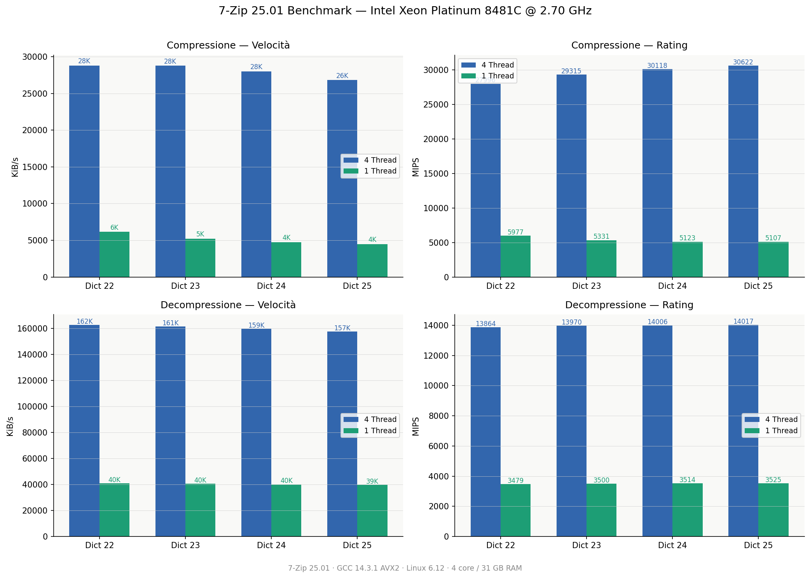
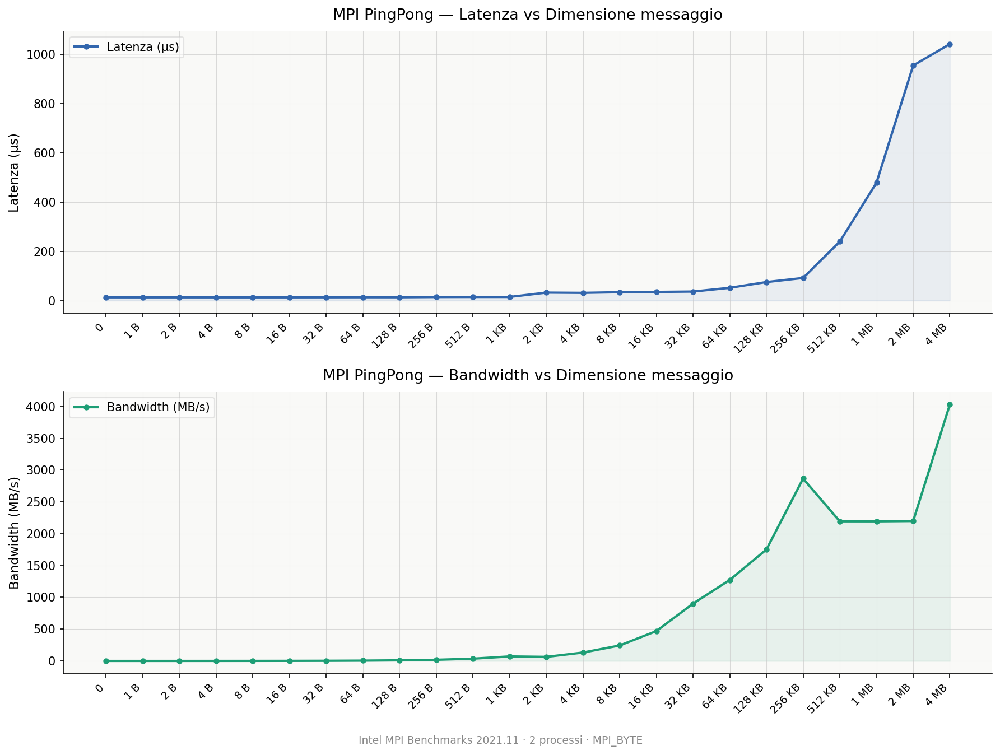

# Parallel Programming & Distributed Computing

<p align="center">
    
</p>

[](https://github.com/mariocosenza)
[](LICENSE)

This repository hosts the laboratory assignments and the final capstone project for the **Programmazione Concorrente, Parallela e su Cloud** course (English: *Concurrent, Parallel and Cloud Programming*) (A.Y. 2026) at the University of Salerno, supervised by Prof. [@spagnuolocarmine](https://github.com/spagnuolocarmine).

To ensure the reproducibility of the experiments, the project leverages Infrastructure as Code (IaC). The repository includes a Terraform configuration script (`main.tf`) designed to automatically provision a compute cluster on the Google Cloud Platform (GCP). For comprehensive deployment instructions, please refer to the *How to Set Up the Experiment* section.

The `mpi` directory contains the source code for Labs 3 through 8, alongside a dedicated examples folder. The core of this repository is **Lab 8**, the final course project, which assesses advanced parallel computing paradigms utilizing the C Message Passing Interface (MPI) standard. Among the three proposed project tracks, this repository implements a distributed version of **Conway's Game of Life**. 

All subsequent sections of this documentation will focus exclusively on the architecture, implementation, and performance analysis of this final project.

## Table of Contents

Click a badge to jump to the corresponding section.

[](#conways-game-of-life) [](#solution-requirements) [](#correctness)

[](#experimental-setup--benchmark-methodology) [](#hardware-configuration-for-the-benchmark) [](#running-the-test)

[](#matrix-naming-convention) [](#test-result-todo)

## Conway's Game of Life

Conway's Game of Life is a iconic **cellular automaton** devised by the British mathematician John Horton Conway in 1970. It is classified as a *zero-player game*, meaning its evolution is entirely determined by its initial state, requiring no further human intervention.

The game unfolds on an infinite or bounded two-dimensional orthogonal grid of square cells, each of which can exist in one of two possible states: **alive** or **dead**. Every cell interacts with its eight immediate neighbors (**Moore neighborhood**). At each step in time (generation), the system transitions to the next state based on a deterministic set of rules applied simultaneously to all cells:

* **Underpopulation:** Any live cell with fewer than two live neighbors dies.
* **Survival:** Any live cell with two or three live neighbors lives on to the next generation unchanged.
* **Overpopulation:** Any live cell with more than three live neighbors dies.
* **Reproduction:** Any dead cell with exactly three live neighbors becomes a live cell.

From a computational perspective, the grid's deterministic synchronization and localized neighborhood dependencies make the Game of Life an ideal candidate for **domain decomposition** and parallel scalability evaluations using MPI.

## Solution Requirements

### Core Architecture and Paradigm
The distributed system is implemented entirely in native **C** and leverages the standard **Message Passing Interface (MPI)** library for parallelization across distributed memory environments.

### Grid Flexibility
The software dynamically supports arbitrary matrix configurations ($M \times N$). It handles non-uniform topologies, uneven edge distributions, and variable aspect ratios without any hardcoded dimensional constraints.

### Execution Depth
The application executes the cellular automaton simulation for any user-defined number of generations ($G \ge 0$). Specifying a depth of zero preserves the initial setup configuration without executing any lifecycle updates.

### Centralized Domain Decomposition
The initialization phase is entirely centralized. The master node (Rank 0) ingests the unsegmented, complete global matrix, handles the initial domain partitioning, and manages the execution flow by scattering the initial data shards to the working processes at runtime.

### Process Invariance
The internal parallel mechanics, halo exchanges, and boundary computations are strictly deterministic. The final simulation state is completely decoupled from the topology of the execution cluster, yielding bit-by-bit identical results regardless of the process count.

### Dynamic Resource Allocation
The codebase adapts dynamically to the execution environment at runtime. The system scales its horizontal boundaries seamlessly to match the exact process count designated by the user during launch execution (e.g., `mpirun -np <P>`).

### Cartesian Process Topology
The worker processes are arranged on a two-dimensional MPI Cartesian grid. The code first chooses the largest process count that still satisfies the minimum local matrix size constraints, then derives the grid shape with `MPI_Dims_create(compute_sz, 2, mpi_dims)`. This produces a row/column layout that reflects the available ranks rather than a hardcoded mesh.

Each worker then creates a Cartesian communicator with `MPI_Cart_create(split_comm, 2, mpi_dims, (int[]){0, 0}, 0, &cart_comm)`. The zero periodicity flags mean the topology is not wrapped around at the borders, so the ranks at the edges of the grid have missing neighbors. Those neighbor relationships are recovered with `MPI_Cart_shift` and are used directly for the halo exchanges on the top, bottom, left, and right borders.

This layout keeps the communication pattern explicit and easy to reason about: each rank exchanges ghost cells only with the ranks that are adjacent to it in the 2D process grid, and the same Cartesian communicator is also reused for collective file I/O on the final matrix.

### Final State Persistence
Upon completing the final iteration, the distributed matrix partitions are automatically gathered and stitched back together on the master node to reconstruct the complete final generation, which is then committed to persistent storage.

All of the implementation snippets below are taken from [mpi/lab8/lab8vm-file.c](mpi/lab8/lab8vm-file.c). They are grouped inside hidden `<details>` blocks that stay collapsed by default, so the explanation stays compact until you expand each section.

<details>
<summary><u>Details section</u>: the first helper splits a global dimension across the available MPI ranks and stores both the per-rank sizes and the starting offsets.</summary>

```c
void partition_dimension(uint32_t total, int parts, int *sizes, int *offsets) {
    uint32_t q = total / (uint32_t)parts;
    uint32_t r = total % (uint32_t)parts;
    uint32_t small = (uint32_t)parts - r;
    uint32_t curr_offset = 0;

    for (int i = 0; i < parts; i++) {
        sizes[i] = (int)((uint32_t)i < small ? q : q + 1);
        if (offsets != NULL) {
            offsets[i] = (int)curr_offset;
        }
        curr_offset += (uint32_t)sizes[i];
    }
}
```

</details>

<details>
<summary><u>Details section</u>: the next helper reads the local submatrix assigned to a worker from the global binary file using the offsets computed by the master process.</summary>

```c
void read_matrix_from_file(void *out_matrix, int *sizes, int *subsizes, int *starts) {
#ifdef _WIN32
    FILE *fp = _fsopen(filename, "rb", _SH_DENYNO);
#else
    FILE *fp = fopen(filename, "rb");
#endif
    if (!fp) {
        MPI_Abort(MPI_COMM_WORLD, EXIT_FAILURE);
    }

    int starts_r_offset = starts[0];
    int starts_c_offset = starts[1];
    int size_c = sizes[1];
    int M = subsizes[0];
    int N = subsizes[1];

    uint8_t (*matrix)[N] = (uint8_t (*)[N])out_matrix;

    for (int i = 0; i < M; i++) {
        long long offset = ((long long)(starts_r_offset + i) * size_c + starts_c_offset) * sizeof(uint8_t);
#ifdef _WIN32
        _fseeki64(fp, (__int64)offset, SEEK_SET);
#else
        fseeko(fp, (off_t)offset, SEEK_SET);
#endif
        fread(matrix[i], sizeof(uint8_t), N, fp);
    }

    fclose(fp);
}
```

</details>

<details>
<summary><u>Details section</u>: this block posts the non-blocking receives for the top and bottom ghost rows used during halo exchange.</summary>

```c
void async_recv_top_bottom(MPI_Comm comm, Game_matrix *gm, int top_rank, int bot_rank, MPI_Request req[2]) {
    req[0] = MPI_REQUEST_NULL;
    req[1] = MPI_REQUEST_NULL;
    if (top_rank != MPI_PROC_NULL) {
        MPI_Irecv(gm->recv_t_ghost, (int)gm->size.cols, MPI_UINT8_T, top_rank, 1, comm, &req[0]);
    }
    if (bot_rank != MPI_PROC_NULL) {
        MPI_Irecv(gm->recv_b_ghost, (int)gm->size.cols, MPI_UINT8_T, bot_rank, 1, comm, &req[1]);
    }
}
```

</details>

<details>
<summary><u>Details section</u>: the worker routine owns the local slice of the matrix, exchanges ghost layers with its neighbors, evolves the automaton for each generation, and optionally writes the final distributed state back to disk.</summary>

```c
void run_worker(int mpi_dims[2], MPI_Comm split_comm, int sizes[2], int subsizes[2], int starts[2]) {
    int w_rank;
    MPI_Comm_rank(split_comm, &w_rank);

    MPI_Comm cart_comm;
    MPI_Cart_create(split_comm, 2, mpi_dims, (int[]){0, 0}, 0, &cart_comm);

    uint32_t local_rows = (uint32_t)subsizes[0];
    uint32_t local_cols = (uint32_t)subsizes[1];

    if (local_rows == 0 || local_cols == 0) {
        MPI_Abort(MPI_COMM_WORLD, EXIT_FAILURE);
    }

    uint8_t (*local_grid)[local_cols] = malloc(sizeof(uint8_t[local_rows][local_cols]));
    if (!local_grid) {
        MPI_Abort(MPI_COMM_WORLD, EXIT_FAILURE);
    }

    read_matrix_from_file(local_grid, sizes, subsizes, starts);

    uint8_t *recv_l_ghost = calloc(local_rows + 2, sizeof(uint8_t));
    uint8_t *recv_r_ghost = calloc(local_rows + 2, sizeof(uint8_t));
    uint8_t *recv_t_ghost = calloc(local_cols, sizeof(uint8_t));
    uint8_t *recv_b_ghost = calloc(local_cols, sizeof(uint8_t));
    
    uint8_t *send_l_buf   = malloc((local_rows + 2) * sizeof(uint8_t));
    uint8_t *send_r_buf   = malloc((local_rows + 2) * sizeof(uint8_t));
    
    uint8_t (*next_local_grid)[local_cols] = malloc(sizeof(uint8_t[local_rows][local_cols]));

    if (!recv_l_ghost || !recv_r_ghost || !recv_t_ghost || !recv_b_ghost || !send_l_buf || !send_r_buf || !next_local_grid) {
        MPI_Abort(MPI_COMM_WORLD, EXIT_FAILURE);
    }

    Game_matrix gm = {
        .size         = { local_rows, local_cols },
        .matrix       = local_grid,
        .recv_l_ghost = recv_l_ghost,
        .recv_r_ghost = recv_r_ghost,
        .recv_t_ghost = recv_t_ghost,
        .recv_b_ghost = recv_b_ghost,
    };

    int top_rank, bot_rank, left_rank, right_rank;
    MPI_Cart_shift(cart_comm, 0, 1, &top_rank, &bot_rank);
    MPI_Cart_shift(cart_comm, 1, 1, &left_rank, &right_rank);

    MPI_Request req_recv_tb[2], req_send_tb[2];
    MPI_Request req_recv_lr[2], req_send_lr[2];
    MPI_Status  mpi_stats[2];

    for (int g = 0; g < N_GEN; g++) {
        async_recv_top_bottom(cart_comm, &gm, top_rank, bot_rank, req_recv_tb);
        async_send_top_bottom(cart_comm, &gm, top_rank, bot_rank, req_send_tb);

        for (uint_fast32_t r = 1; r + 1 < local_rows; r++) {
            for (uint_fast32_t c = 1; c + 1 < local_cols; c++) {
                play_inner_cells(gm.matrix, next_local_grid, r, c, local_cols);
            }
        }

        MPI_Waitall(2, req_recv_tb, mpi_stats);
        MPI_Waitall(2, req_send_tb, mpi_stats);

        pack_left_right_send_buffers(&gm, send_l_buf, send_r_buf);
        
        async_recv_left_right(cart_comm, &gm, left_rank, right_rank, req_recv_lr);
        async_send_left_right(cart_comm, &gm, left_rank, right_rank, send_l_buf, send_r_buf, req_send_lr);

        MPI_Waitall(2, req_recv_lr, mpi_stats);
        MPI_Waitall(2, req_send_lr, mpi_stats);

        for (uint_fast32_t c = 0; c < local_cols; c++) {
            play_border_cells(&gm, next_local_grid, 0, c);
            if (local_rows > 1) {
                play_border_cells(&gm, next_local_grid, local_rows - 1, c);
            }
        }
        
        for (uint_fast32_t r = 1; r + 1 < local_rows; r++) {
            play_border_cells(&gm, next_local_grid, r, 0);
            if (local_cols > 1) {
                play_border_cells(&gm, next_local_grid, r, local_cols - 1);
            }
        }

        void *tmp_ptr   = gm.matrix;
        gm.matrix       = next_local_grid;
        next_local_grid = tmp_ptr;
    }

    
    if (SAVE_OUTPUT) {
        MPI_Datatype file_type;
        MPI_Type_create_subarray(2, sizes, subsizes, starts,
                             MPI_ORDER_C, MPI_UINT8_T, &file_type);
        MPI_Type_commit(&file_type);
        MPI_File fh;
        MPI_File_open(cart_comm, "full_matrix.bin", 
                      MPI_MODE_CREATE | MPI_MODE_WRONLY, MPI_INFO_NULL, &fh);
                      MPI_File_set_view(fh, 0, MPI_UINT8_T, file_type, "native", MPI_INFO_NULL);

        MPI_File_write_all(fh, gm.matrix, local_rows * local_cols, MPI_UINT8_T, MPI_STATUS_IGNORE);
    
        MPI_File_close(&fh);
        MPI_Type_free(&file_type);
    }

    free(recv_l_ghost);
    free(recv_r_ghost);
    free(recv_t_ghost); 
    free(recv_b_ghost);
    free(send_l_buf);
    free(send_r_buf);
    free(next_local_grid);
    free(gm.matrix);
    
    MPI_Comm_free(&cart_comm);
}
```

</details>

<details>
<summary><u>Details section</u>: the master routine computes the 2D partition, prepares the metadata for every worker, and sends the size and offset information needed to reconstruct the global layout.</summary>

```c
void run_master(int mpi_dims[2], MPI_Comm split_comm, uint32_t M, uint32_t N, int sizes[2], int subsizes[2], int starts[2]) {
    int row_sizes[mpi_dims[0]], row_offsets[mpi_dims[0]];
    int col_sizes[mpi_dims[1]], col_offsets[mpi_dims[1]];
    
    partition_dimension(M, mpi_dims[0], row_sizes, row_offsets);
    partition_dimension(N, mpi_dims[1], col_sizes, col_offsets);

    sizes[0] = (int)M; 
    sizes[1] = (int)N;

    int compute_sz;
    MPI_Comm_size(split_comm, &compute_sz);

    for (int i = 1; i < compute_sz; i++) {
        int r_idx = i / mpi_dims[1];
        int c_idx = i % mpi_dims[1];
        
        int sub[2] = { row_sizes[r_idx], col_sizes[c_idx] };
        int st[2]  = { row_offsets[r_idx], col_offsets[c_idx] };

        MPI_Send(sizes, 2, MPI_INT, i, 0, split_comm);
        MPI_Send(sub, 2, MPI_INT, i, 1, split_comm);
        MPI_Send(st, 2, MPI_INT, i, 2, split_comm);
    }

    subsizes[0] = row_sizes[0];
    subsizes[1] = col_sizes[0];
    starts[0]   = row_offsets[0];
    starts[1]   = col_offsets[0];
}
```

</details>

<details>
<summary><u>Details section</u>: the `main` entry point ties the whole application together: it reads the user parameters, initializes MPI, chooses how many processes can actually be used for the current matrix size, builds the 2D process grid, splits the global communicator, dispatches the master and worker roles, and finally reduces the execution time so the root rank can print the overall benchmark result.</summary>

```c
int main(int argc, char **argv) {
    uint32_t M = 10000;
    uint32_t N = 10000;
    
    parse_args(argc, argv, &M, &N);

    MPI_Init(&argc, &argv);
    MPI_Barrier(MPI_COMM_WORLD);
    double start_time = MPI_Wtime();

    int rank, num_procs;
    MPI_Comm_rank(MPI_COMM_WORLD, &rank);
    MPI_Comm_size(MPI_COMM_WORLD, &num_procs);

    int compute_sz = num_procs;
    while (compute_sz > 1 && !is_min_size((uint32_t)compute_sz, M, N)) {
        compute_sz--;
    }

    int mpi_dims[2] = {0, 0};
    MPI_Dims_create(compute_sz, 2, mpi_dims);

    if (mpi_dims[0] <= 0 || mpi_dims[1] <= 0) {
        MPI_Abort(MPI_COMM_WORLD, EXIT_FAILURE);
    }

    int split_color = (rank < compute_sz) ? 1 : MPI_UNDEFINED;
    MPI_Comm split_comm;
    MPI_Comm_split(MPI_COMM_WORLD, split_color, rank, &split_comm);

    if (split_comm != MPI_COMM_NULL) {
        int sizes[2], subsizes[2], starts[2];

        if (rank == 0) {
            run_master(mpi_dims, split_comm, M, N, sizes, subsizes, starts);
        } else {
            MPI_Recv(sizes, 2, MPI_INT, 0, 0, split_comm, MPI_STATUS_IGNORE);
            MPI_Recv(subsizes, 2, MPI_INT, 0, 1, split_comm, MPI_STATUS_IGNORE);
            MPI_Recv(starts, 2, MPI_INT, 0, 2, split_comm, MPI_STATUS_IGNORE);
        }

        run_worker(mpi_dims, split_comm, sizes, subsizes, starts);
        MPI_Comm_free(&split_comm);
    }

    TimeRankPair local_time = { MPI_Wtime() - start_time, rank };
    TimeRankPair max_time;
    
    MPI_Reduce(&local_time, &max_time, 1, MPI_DOUBLE_INT, MPI_MAXLOC, 0, MPI_COMM_WORLD);

    if (rank == 0) {
        printf("Max Time: %f s (Rank: %d)\n", max_time.time, max_time.rank);
    }

    MPI_Finalize();
    return 0;
}
```

</details>

<details>
<summary><u>Details section</u>: the last utility generates the seed matrix used as input for the simulation. It supports the following parameters: `-M <rows>`, `-N <cols>`, `-S <seed>` for deterministic random generation, `-P <pattern>` for predefined shapes (`0` random, `1` glider, `2` blinker, `3` block, `4` custom/manual input), and `-R` to read `full_matrix.bin` and print it instead of creating a new file. In custom mode, the program prompts for each cell value and writes the entered 0/1 matrix directly to disk.</summary>

```c
void write_matrix_to_file_fast(uint32_t M, uint32_t N) {
    char filename[256];
    sprintf(filename, "matrix_%ux%u_seed%u_pattern%d.bin", M, N, SEED, PATTERN);
    FILE *fp = fopen(filename, "wb");
    if (!fp) {
        perror("Errore nell'apertura del file");
        exit(EXIT_FAILURE);
    }

    uint8_t *row_buffer = calloc(N, sizeof(uint8_t));
    if (!row_buffer) {
        printf("Errore di allocazione memoria\n");
        exit(EXIT_FAILURE);
    }

    if (PATTERN == 0) srand(SEED);

    for (uint32_t r = 0; r < M; r++) {
        if (PATTERN != 0) {
            memset(row_buffer, 0, N * sizeof(uint8_t));
        }

        if (PATTERN == 0) {
            for (uint32_t c = 0; c < N; c++) {
                row_buffer[c] = (rand() % 2 == 0);
            }
        } else if (PATTERN == 1 && r < 3 && M >= 3 && N >= 3) {
            // Glider top left
            if (r == 0) { row_buffer[1] = 1; }
            else if (r == 1) { row_buffer[2] = 1; }
            else if (r == 2) { row_buffer[0] = 1; row_buffer[1] = 1; row_buffer[2] = 1; }
        } else if (PATTERN == 2 && M >= 3 && N >= 3) {
            // Blinker center
            if (r == M / 2) { row_buffer[N / 2 - 1] = 1; row_buffer[N / 2] = 1; row_buffer[N / 2 + 1] = 1; }
        } else if (PATTERN == 3 && M >= 2 && N >= 2) {
            // Block center
            if (r == M / 2 || r == M / 2 + 1) { row_buffer[N / 2] = 1; row_buffer[N / 2 + 1] = 1; }
        }

        fwrite(row_buffer, sizeof(uint8_t), N, fp);
    }

    free(row_buffer);
    fclose(fp);
    
    const char* pattern_names[] = {"Random", "Glider", "Blinker", "Block"};
    printf("Matrice %u x %u scritta su %s (Pattern: %s)\n", M, N, filename, pattern_names[PATTERN]);
}
```

</details>

`verify.c` is a checker utility: it reads `full_matrix.bin`, prints the matrix row by row, and counts the live cells so you can quickly validate the generated state.

`view.c` is the visual inspection tool: it loads the initial and final binary matrices, compares them, and offers a GUI to toggle between wipe and fade animations while showing summary statistics.

## Matrix Naming Convention

Input matrices generated for the simulation follow the naming pattern `matrix_<rows>x<cols>_seed<seed>_pattern<pattern>.bin`. This convention makes every file self-descriptive: the matrix dimensions are embedded first, followed by the random seed used for deterministic generation and the pattern selector used to build the initial state.

The main runtime output produced by the MPI application is `full_matrix.bin`, which stores the complete final generation after the distributed execution ends. Together, these names make it easy to trace a run from its input matrix to its final result.

## Correctness

The generator, the MPI runtime, and the visual tools all use the same raw matrix format: a file is just $M \times N$ bytes written row by row, with one `uint8_t` per cell and no header. That is why a matrix created by [generate_seed.c](mpi/lab8/generate_seed.c) can be consumed directly by [lab8vm-file.c](mpi/lab8/lab8vm-file.c) and by the visual tools.

## Code Correctness and Validation Report

The correctness of this 2D parallel MPI implementation of Conway's Game of Life was validated through deterministic pattern tests, visual cross-checking, boundary-focused checks, and binary output comparison.

1. Local rule validation with static patterns. The transition functions [play_inner_cells](mpi/lab8/lab8vm-file.c) and [play_border_cells](mpi/lab8/lab8vm-file.c) were checked with classic Game of Life structures. The Block still life remained unchanged across multiple generations, confirming stable survival behavior. The Blinker oscillator alternated between its vertical and horizontal states and returned to its initial configuration on even generations, confirming the expected live-cell transition rules.

2. Validation of domain decomposition and ghost-cell exchange. Boundary behavior was exercised with patterns placed across process borders. A block split between two adjacent ranks remained stable, which supports the correctness of the top/bottom and left/right halo exchanges. A glider crossing the intersection of four MPI subdomains preserved its shape and motion, which is consistent with the ordered exchange sequence used by the worker routine.

3. Manual cross-check with a visual simulator. Selected generated configurations were compared against the same initial setups in [PlayGameOfLife.com](https://playgameoflife.com/). The observed evolution matched the expected step-by-step behavior of Conway's Game of Life for the tested cases.

4. Pattern selection and scope. The repository focuses on representative structural patterns rather than exhaustively enumerating every known Life object. In practice, testing still lifes, oscillators, and moving patterns covers the core local interactions exercised by the implementation.

5. Differential output comparison. For a fixed random seed, the final output files produced with different MPI process counts were compared using SHA-256 on Windows. The matching hashes show that, for the tested inputs, the parallel execution produced bitwise identical final states across those process counts.

`pattern 4` in [generate_seed.c](mpi/lab8/generate_seed.c) is the manual-input mode. It reads exactly one `0` or `1` value for each cell, validates the input, and writes the resulting grid in row-major order to `matrix_<rows>x<cols>_seed<seed>_pattern4.bin`. Because the output layout matches the runtime layout, the file can be loaded without any conversion step.

[view.c](mpi/lab8/view.c) reads the same raw byte layout with a plain `fread`, so it can display matrices generated by [generate_seed.c](mpi/lab8/generate_seed.c) as long as the user selects the correct dimensions for the file being opened. In other words, the viewer does not expect a header or metadata block; it expects the exact same flat matrix encoding used by the MPI code.

Example of a generated 5x5 pattern:

<p align="center">
    
</p>

## Experimental Setup & Benchmark Methodology

The performance evaluation of this distributed system was conducted across two distinct hardware environments: a local Windows development machine and a high-performance distributed computing cluster provisioned on the Google Cloud Platform (GCP).

### Windows Local Environment Setup

To conduct local comparative performance profiling, the application supports execution via both **Microsoft MPI (MS-MPI)** and **Intel oneAPI MPI**.

#### 1. Microsoft MPI (MS-MPI) Implementation

1. Download and run the official MS-MPI installer executable from the [Microsoft Download Center](https://www.microsoft.com/en-us/download/details.aspx?id=105289).
2. Manually append the binaries path to your system's environment variables (`PATH`) to expose `mpiexec` and `mpicc` natively inside PowerShell or the Command Prompt.
3. For compilation on `x86-64` Windows environments via GCC (such as the Cygwin toolchain), the include directories and library paths must be explicitly linked.

You can automate this build process in Visual Studio Code by mapping the compilation to a shortcut (`Ctrl+Shift+B`) using the following configuration inside `.vscode/tasks.json`:

```json
{
    "label": "Windows: Compile MPI C",
    "type": "shell",
    "command": "gcc",
    "args": [
        "${file}",
        "-o", "${fileDirname}\\${fileBasenameNoExtension}.exe",
        "-I", "C:\\Program Files (x86)\\Microsoft SDKs\\MPI\\Include",
        "-L", "C:\\Program Files (x86)\\Microsoft SDKs\\MPI\\Lib\\x64",
        "-lmsmpi"
    ],
    "group": "build"
}
```

#### 2. Intel oneAPI MPI & VTune Profiling

For deeper hardware-level auditing, the primary choice for this project was the Intel MPI ecosystem due to its native cross-platform availability and diagnostic toolchain integration.

Install Visual Studio 2026 or Visual Studio Build Tools 2026, ensuring the Desktop Development with C++ workload is checked, specifically including the MSVC v143 toolchain and the Windows 11 SDK.

Download the online installer for the Intel oneAPI Base Toolkit and HPC Toolkit.

Select the Intel VTune Profiler option during setup. VTune provides deep-dive performance metrics for distributed applications, uncovering architectural hotspots, threading efficiency, HPC characterizations, and memory access bottlenecks.

> Note: To activate hardware-level low-overhead event profiling inside VTune, the required Intel sampling drivers must be installed with administrative privileges on your platform.

### Compiler Optimization Flags

While Intel provides different MPI compilers, all source files in this project are compiled using `mpiicx`. This is Intel's latest generation C/C++ compiler based on the modern LLVM framework, offering stronger vectorization and optimization passes.

The compilation string is specifically tailored to maximize hardware utilization on the host architecture while safely bypassing compiler bottlenecks:

```bash
mpiicx -O3 -QxHost -Qipo -ffast-math -Qiopenmp-simd -Qopt-mem-layout-trans:3 /D_CRT_SECURE_NO_WARNINGS lab8vm-file.c -o game_of_life.exe
```

| Flag | Functional Purpose |
| --- | --- |
| `-O3` | Enables aggressive high-level optimizations, including loop vectorization, unrolling, and aggressive code restructuring. |
| `-QxHost` / `-xHost` | Directs the compiler to generate specialized code targeting the highest instruction set architecture extensions available natively on the compilation host machine. |
| `-Qipo` / `-ipo` | Activates interprocedural optimization, analyzing code structures across multiple source translation units to optimize function inlining. |
| `-ffast-math` | Breaks strict IEEE 754 compliance for floating-point math to accelerate execution through hardware approximations. |
| `-Qiopenmp-simd` | Forces the compiler to scan and optimize OpenMP SIMD directives to vectorize loops without runtime threading overhead. |
| `-Qopt-mem-layout-trans:3` | Performs level-3 memory layout transformations on data structures to maximize cache spatial locality and improve structural layout alignment. |

### Process Pinning & Thread Affinity

To mitigate execution jitter caused by the operating system migrating processes across different physical cores, explicit process pinning was enforced via the Intel MPI runtime environment variables:

```bash
mpiexec -n <P> -genv I_MPI_PIN_DOMAIN=core -genv I_MPI_PIN_ORDER=compact game_of_life.exe
```

`I_MPI_PIN_DOMAIN=core` binds each individual MPI process to an isolated physical CPU core.

`I_MPI_PIN_ORDER=compact` allocates sibling ranks to adjacent cores first, optimizing cache sharing and lowering inter-node latency.

### Linux Cluster Environment Setup

For horizontal scale evaluation, cluster orchestration on the Google Cloud Platform is completely automated through Terraform, leveraging an infrastructure bootstrap script (`install.sh`).

The provisioning script automates the complete provisioning pipeline on Rocky Linux nodes:

1. User identity and privilege access: creates a dedicated system user `pcpc` bound to the security group `wheel` to authorize seamless passwordless sudo execution.
2. Core dependencies provisioning: automatically resolves packages via `dnf` to install system compilation assets (`vim`, `git`, `gcc`, `gcc-c++`, `make`) alongside security binaries (`openssh-clients`, `openssh-server`).
3. Intel oneAPI repository mapping: configures the official Intel package signatures (`oneAPI.repo`) to handle repository metadata verification.
4. Cloud-native MPI integration: automatically detects GCP instances and hooks into `google_install_intelmpi` to link specialized low-latency fabrics.
5. HPC stack installation: installs the unified parallel runtime stack (`intel-oneapi-compiler-dpcpp-cpp`, `intel-oneapi-mpi-devel`, and `intel-oneapi-vtune`).
6. Passwordless inter-node authentication: programmatically bakes the generated deployment RSA keys (`id_rsa`, `id_rsa.pub`) into the `authorized_keys` vault of all nodes, enforcing strict security boundaries and ensuring smooth rank execution during `mpirun`.
7. Repository setup: automatically clones the source repository into `/home/pcpc/pcpc-mpi`.
8. Environmental variable initialization: automatically injects the Intel compilation variables (`setvars.sh`) and core pinning topologies directly into the user's login shell profiles (`.bashrc`).
9. Targeted native compilations: accesses the workspace directory and dynamically applies the specific Intel Sapphire Rapids hardware optimization flags (`-xSAPPHIRERAPIDS`) to build the binaries using the LLVM-based `mpiicx` compiler:

```bash
FLAGS="-O3 -xSAPPHIRERAPIDS -ipo -ffast-math -fiopenmp-simd -qopt-mem-layout-trans=3"
mpiicx $FLAGS generate_seed.c -o generate_seed
mpiicx $FLAGS lab8vm-file.c -o game_of_life
```

## Hardware Configuration for the Benchmark

### Windows Local Machine

| Item | Details |
| --- | --- |
| OS | Windows 11 build 26200 |
| CPU | 12th Gen Intel Core i5-1235U with a 1.30 GHz base clock and up to 4.40 GHz turbo, with 2 performance cores, 8 efficiency cores, and 12 logical processors total |
| Memory | 8 GB RAM |
| Storage | 500 GB SSD |
| Power profile | High performance |
| Power state | Connected to the power supply |
| Virtual memory | Swap file enabled |

### GCP Cluster

| Item | Details |
| --- | --- |
| Region | `us-west2` |
| Node count | 8 |
| Placement policy | `availability_domain_count = 1`, `collocation = "COLLOCATED"` |
| OS image | `rocky-linux-10-optimized-gcp-v20260427` |
| Machine type | `c3-standard-8` |
| CPU | Intel(R) Xeon(R) Platinum 8481C CPU @ 2.70GHz |
| Hyperthreading | Disabled |
| Core mapping | 1:1 mapping between vCPU and physical core |
| Memory | 32 GB RAM per node |
| Storage | 40 GB Hyperdisk Balanced, 3000 IOPS, 360 MB/s throughput |
| Network tier | Premium |
| Firewall | Intra-cluster SSH, TCP, and UDP allowed with the `mpi-node` tag |

<details>
<summary><u>Details section</u>: 7-Zip benchmark</summary>

The chart below compares the 7-Zip test executed with a single core and with multiple cores, giving a quick view of the local CPU throughput scaling.



</details>

<details>
<summary><u>Details section</u>: Intel MPI PingPong benchmark</summary>

The image below shows the Intel MPI PingPong test, which measures the basic network latency between nodes in the cluster.



</details>

## Running the Test

To run the benchmark, first build the matrix generator from [generate_seed.c](mpi/lab8/generate_seed.c) and then use it to create the input matrix for the simulation.

| Platform | Steps |
| --- | --- |
| Windows | Compile the generator first, then run the matrix-generation batch script. After that, launch [run_game_of_life_test.bat](mpi/lab8/run_game_of_life_test.bat). |
| Linux | Run the matrix-generation batch script on each node so it can create the input matrix and the Intel MPI-compatible hostfile in `IP:N_CPU` format. Then launch [run_game_of_life_test.sh](mpi/lab8/run_game_of_life_test.sh). |

The benchmark writes the execution time to a `.txt` file together with the matrix size and the number of MPI processes used for the run. VTune profiling results are saved in separate directories that follow the matrix naming convention.

> Note: the full test can take around 30 minutes.

Additional notes:

- On Linux, make sure the scripts have execute permission before running them.
- On Windows, run the VTune test as Administrator.

## Test Result TODO

- TODO: document the expected benchmark outputs and the naming convention of the generated `.txt` result files.
- TODO: summarize the VTune profiling directories and explain how to read the collected reports.
